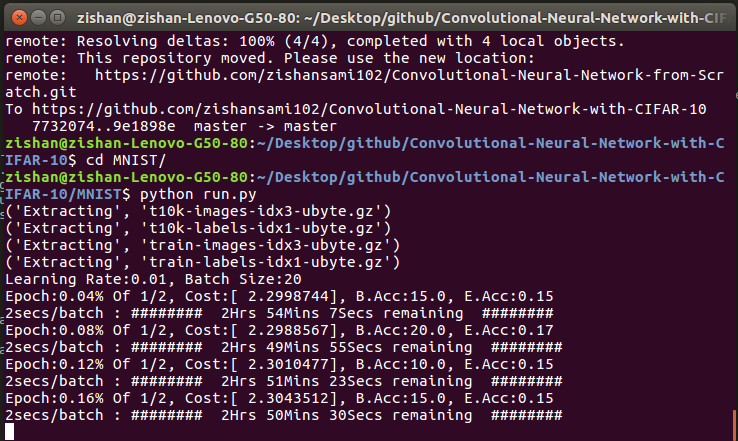

# Convolutional Neural Network from scratch [](http://cnndigits.pythonanywhere.com/)

### [Live Demo](http://cnndigits.pythonanywhere.com/) 

Objective of this work was to write the `Convolutional Neural Network` without using any Deep Learning Library to gain insights of what is actually happening and thus the algorithm is not optimised enough and hence is slow on large dataset like CIFAR-10.
This piece of code could be used for `learning purpose` and could be implemented with trained parameter available in the respective folders for any testing applications like `Object Detection` and `Digit recognition`.<br/>
`It's Accuracy on MNIST test set is above 97%.`


## Architecture

INPUT - CONV1 - RELU - CONV2 - RELU- MAXPOOL - FC1 - OUT


## Getting Started 

These instructions will get you a copy of the project up and running on your local machine for development and testing purposes.

### Prerequisites

* [Numpy](http://www.numpy.org/) - Multidimensioanl Mathematical Computing
* [Matplotlib](https://matplotlib.org/contents.html) - Used to plot Graph
* [Pickle](https://docs.python.org/3/library/pickle.html) - Used to save trained models/object
* [MNIST Dataset](http://yann.lecun.com/exdb/mnist/) - Dataset for Digit Recognition
* [CIFAR-10 Dataset](http://www.cs.toronto.edu/~kriz/cifar.html) - Dataset for Object Recognition

Followings are also required if working/testing on the app.py

* [Flask](http://flask.pocoo.org/) - A microframework for Python
* [Gunicorn](http://gunicorn.org/) - A Python WSGI HTTP Server for UNIX

### Directories

- `CIFAR-10 `: Object detection with [CIFAR-10](http://www.cs.toronto.edu/~kriz/cifar.html)
- `MNIST `: Handwritten Digits Recognition with [MNIST](http://yann.lecun.com/exdb/mnist/)


### Installing

* Clone the repository

```
git clone https://github.com/zishansami102/CNN-from-Scratch
```

* Downlad the dataset and copy that to it's corresponding folder(CIFAR-10/MNIST).
* Move into the required directory and then run the following command to start training model

```
python run.py
```

Output:




* To load pre-trained models, change the pickle filename from output.pickle to trained.pickle in run.py: `line No. - 27-28` and comment out the training part form the code in run.py: `line No. - 80-104`


## Contributing

### KWoC Action Plan
[KWoC Google Group](https://groups.google.com/forum/#!forum/cnn-from-scratch)

#### Short term Issues

See the issue section of this repositiory

#### Long term project


Plan is to make a Web App which can predict the digit between 0 to 9 if the user writes anything on the app drawing board(using the functions written in convnet.py).
Following are the steps in which we may proceed:

* A python based Flask API which recieves image as input and gives digit prediction for that image as output
* Front-end of the Web App which should have a drawing board on which the user will draw
* Integration of the API with the front-end

Respond on the [google group](https://groups.google.com/forum/#!forum/cnn-from-scratch) from the list above to know details and start the contribution


## Acknowledgments

* [CS231n.stanford.edu](http://cs231n.stanford.edu/) - Most of the theorotical concepts are taken from here
* [dorajam](https://github.com/dorajam/Convolutional-Network) - Used to gain more concepts
* [Mathematical Concepts](http://www.jefkine.com/general/2016/09/05/backpropagation-in-convolutional-neural-networks/) - Still need to be implemented, but helpful to gain insight
